# WebTrack

### ▶ [Play it](https://markclausing.github.io/webtrack/)

A polygon racing game in the browser, in the spirit of the first generation of
them. Seven closed circuits, eight single seaters, a red suspension bridge to
cross, and an afternoon that runs out: you start in daylight, the sun is on the
horizon by the second lap and you finish in the dark.

Three of the circuits were drawn by a random number generator. Four of them are
Spa, Monza, Suzuka and Zandvoort, from surveyed centre lines, with the elevation
and the banking written in by hand.

Two ways to go out — put a lap in on an empty circuit, or start eighth of eight
against seven cars in the same machinery as yours that will shut the door.

Whichever you drive, the time goes on a shared board.

No dependencies, no build step, no WebGL — HTML, CSS and JavaScript exactly as
the browser receives them, and a polygon renderer written by hand into a
`Uint32Array` at 320 × 224. It is the fifth game built this way, after
[websoccer](https://github.com/markclausing/websoccer),
[webtennis](https://github.com/markclausing/webtennis),
[webracing](https://github.com/markclausing/webracing) and
[webtype](https://github.com/markclausing/webtype).

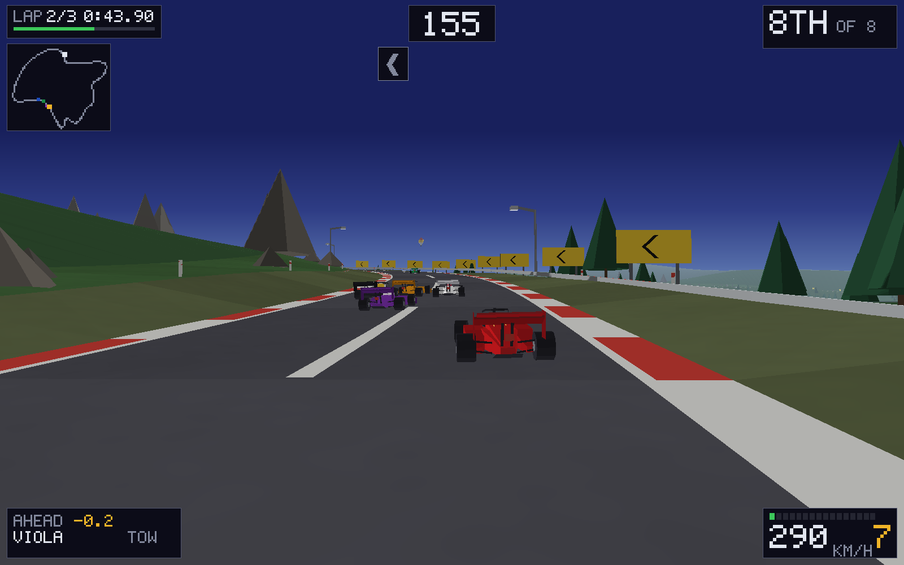

## Running it yourself

```bash
git clone https://github.com/markclausing/webtrack.git
cd webtrack && npm start
```

Then open http://localhost:8080/. There is no `npm install`, because there is
nothing to install.

## Controls

|                   | Keys        |
| ----------------- | ----------- |
| Accelerate        | `↑`         |
| Brake             | `↓`         |
| Steer             | `←` / `→`   |
| Pause             | `Esc`       |

One car and one driver, so the arrows are the default rather than W A S D — the
other four games in this family seat two people at one keyboard and this one does
not. Every key can be changed in the menu, and W A S D is one of the presets. Gamepads need no setting up: the stick
steers and any face button is the throttle.

On a phone, hold it sideways. The bottom-left corner is the wheel, `GAS` is the
big button, `BRAKE` is the small one beside it, and the little `II` at the top
pauses.

### What the rivals do

Seven of them, in the same machinery as yours, and the difficulty setting moves
their grip and your clock rather than giving them anything you do not have. They
work out a braking point the same way you do — how fast may I be going for what
is coming — and they take a corner from the outside of it, which is the only way
round that is quick.

They also leave nine metres to the car in front. That sounds like nothing and it
is most of the racing: without it the one behind simply drove into the one ahead,
was shoved sideways, lost three and a half per cent of its speed and did it
again. They spend forty per cent of a race within fifteen metres of somebody, so
that ran to about three seconds a lap — the fastest of them could lap Spa in 1:58
while the field averaged 2:01, and the difference went straight to whoever was in
clean air. Which was always you.

## Two ways out

**Qualifying** is an empty circuit, three laps and a long clock. Only one number
survives it: your quickest single lap. Nobody in your mirrors and nothing to
blame.

**Grand Prix** is seven other cars and a standing start from the back row. The
board keeps the whole race rather than your best lap, because a quick lap in a
race you lost is a consolation and not a result.

They keep separate boards. A lap on empty tarmac and a lap spent trying to get
past somebody are not comparable and never will be.

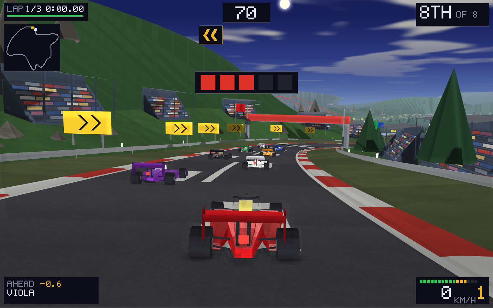

## How it drives

**Grip is one number and you are always spending it.** A corner of curvature *k*
asks for *v²k* of sideways acceleration. If the car has that much it goes where
it is pointed and whatever is left over is what the steering has to work with; if
it does not, the difference goes two ways at once — outwards, as the car running
wide, and backwards, as speed scrubbed off the tyres. That is the entire driving
model. It is four lines in `sim.js` and everything that feels like driving comes
out of it.

**A corner is something you do, not something that happens.** A third of what the
corner is asking for arrives as a push at the outside of it, all the way round,
and the wheel is what you hold against it. This is the difference between a
driving game and a game about a car: before it existed the car followed the road
on its own and the wheel only moved you across it — a lap driven flat out with no
brakes at all, leaning on the barrier for a quarter of it, was **five seconds
quicker** than a lap driven properly. There was no reason to slow down, because
slowing down bought you nothing. Now the same experiment is fifteen seconds
slower, and the test suite runs it every time.

**The keys move a wheel, not a car.** A keyboard has two positions and a corner
needs all the ones in between, so a tap is a small correction and a held key
winds on more lock. Without it the only way to hold a line against the push above
would be to tap the key thirty times a corner, which is not driving, it is morse
code.

The consequence you feel first is that at the limit **the wheel stops
answering**. That is not the corner being unfair, it is the corner telling you to
brake earlier. The consequence you feel later is that lifting in the middle of
one gives you the front end back.

**Brake in a straight line, then turn.** The brakes are worth four and a half g
and the corner is worth three. You can have all of one or all of the other, and
asking for both at once gets you neither and a lot of grass.

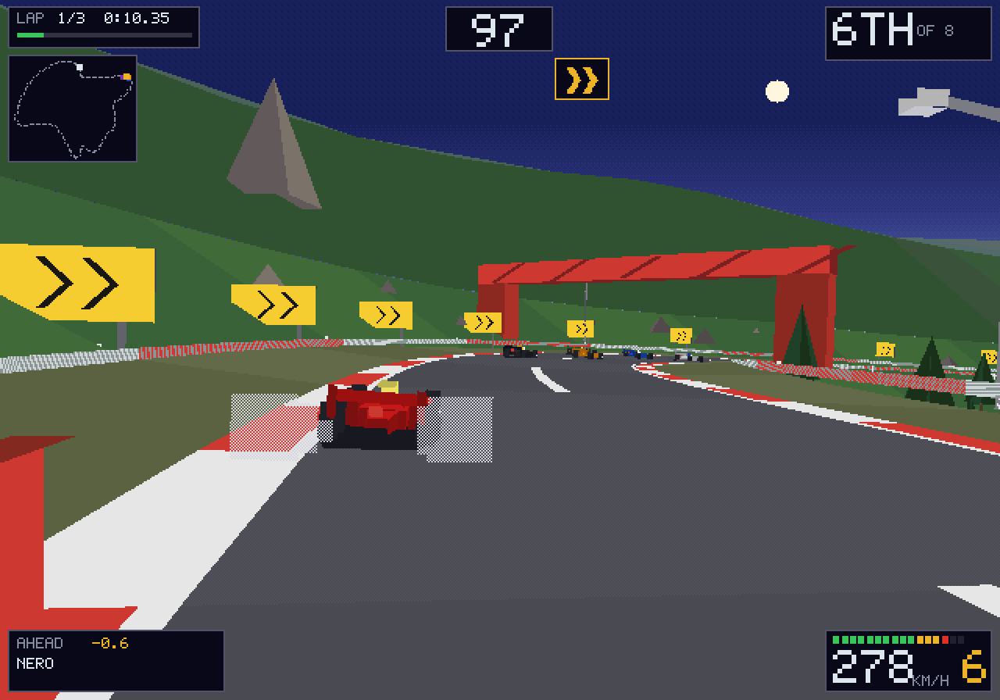

**Sit behind somebody on the straight.** The tow removes nearly half your drag
and is worth about twenty km/h. It reaches forty metres and needs you roughly
behind them, which is what makes the last third of a straight interesting instead
of a formality.

**The kerbs are yours; the grass is not.** Two wheels on the red and white costs
you very little. Four wheels on the green costs three quarters of your grip, and
the barrier costs you four fifths of your speed — which is the number that stops
driving at the scenery being a racing line.

**There is a map in the corner.** It is the one thing the view out of the cockpit
cannot give you: where the next corner but one goes, and where the other seven
are when they are not in front of you.

**And the light goes.** The race starts in the afternoon, has the sun on the
horizon by the second lap and finishes at night, gradually and without ever doing
it in front of you. It is measured on distance rather than on the clock, so a
race that has gone badly gets dark at the same place on the circuit as one that
has gone well. The floodlights beside the track come on at dusk, a good half hour
before anybody needs them, which is what a real circuit does.

There is a switch for it in the menu, and it is off to begin with: a circuit you
are still learning is easier to learn in the light, and the board does not care
which you drove in.

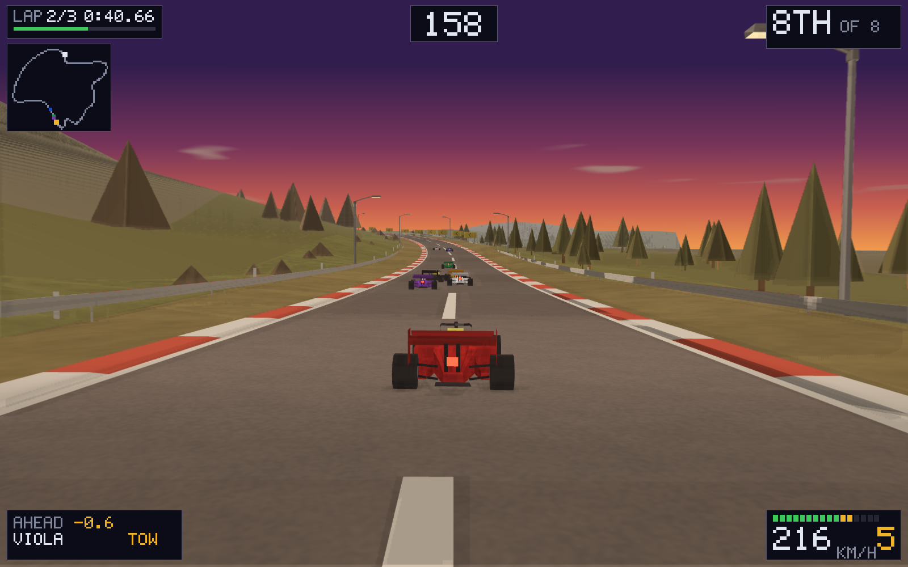

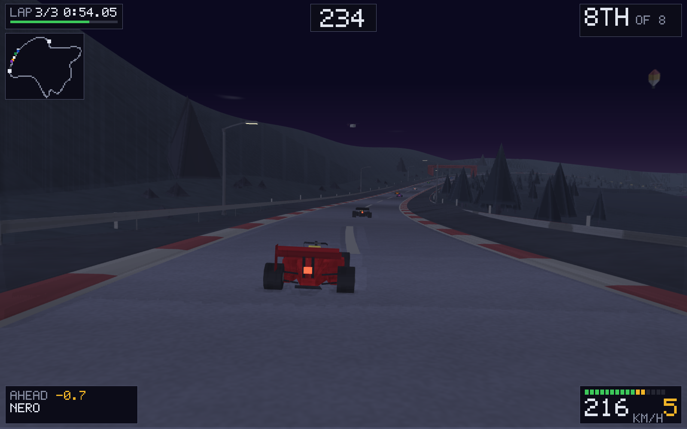

**They will shut the door on you.** A rival with somebody in its mirrors moves
part of the way across to cover the side you are coming down — part, so there is
always a way past, and only on the approach, because covering the inside of a
corner it is already in means going off the outside of it. Make them commit, then
go the other way.

**They are in exactly the car you are in.** On normal the multiplier is one: no
extra grip, no extra top end, no rubber band, no catching you up when you crash
and no pulling away when you do not. That is only a fair fight because they now
drive it properly, which for a long time they did not — see below. Easy gives
them five per cent less and you six per cent more; hard gives them seven and a
half per cent more.

**What made them slow was never their pace, it was their traffic.** Alone on the
circuit they were always within a second a lap of a competent drive. In a pack of
eight they were ten seconds a lap slower, and all of it was self-inflicted: every
car within twenty-six metres of another made it drive defensively, so in a field
this close all eight spent three laps off the racing line covering each other;
and two cars leaning on each other were charged three and a half per cent of
their speed *every frame it lasted*, which is twelve per cent a second, so nobody
could run alongside anybody through a corner without both of them losing the
race. They now lose three tenths of a second a lap to each other, and the test
suite measures exactly that, because it is the failure this game keeps drifting
back into.

They aim at the apex and nothing cleverer. A proper three-phase racing line —
outside on entry, apex, outside on exit — was tried and made them two seconds a
lap slower and put them on the grass a third of the time: the line moves further
and faster than their steering can follow, and a car sawing at a line it cannot
hold is slower than a car holding a worse one.

What they did need was to steer at where the car is *going* as well as at where
it is. A corner pushes continuously, and a controller that only looks at the
error has a standing one: they spent eight per cent of every lap off the tarmac
and hit the barrier twice a lap, alone, on an empty circuit. One term for the
lateral velocity took that to a third of a per cent and three hundredths.

**And they stay in touch with each other.** The field is spread by about one per
cent of pace from pole to the back row, end to end. That number is doing more for
the racing than any other in the file: at four per cent the front row was half a
minute up the road by the flag and you were racing two cars rather than seven. As
it stands somebody is within ninety metres of you for about eighty per cent of a
race, which is a thing the test suite measures and would notice going away.

## Seven circuits

### The three that were drawn

**The pass** is 4.3 km through the mountains, climbing fifty metres and giving it
all back — three kinds of corner, all of them third gear or lower, with enough
between them to use what you gained. Three laps. **The boulevard** is 5.7 km of
sea front: flat, open, and quick enough that the corners which do matter matter a
great deal. Three laps. **The grand circuit** is 8.2 km out of the hills, down to
the water and back up again, and it is two laps because one of them is already a
long afternoon.

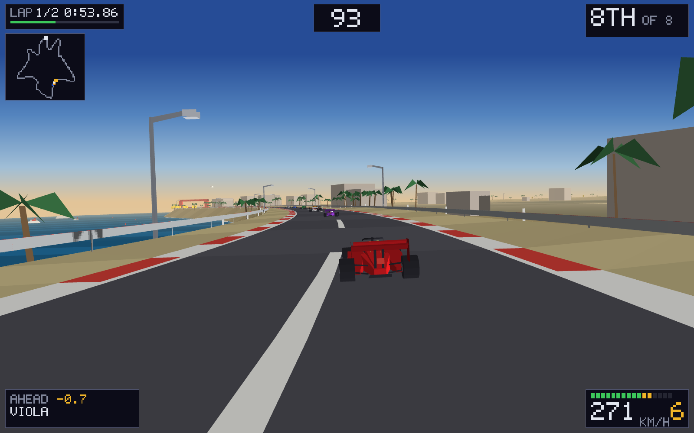

### The four that are places

**Spa-Francorchamps**, 7.0 km, with the hundred metres of height it is famous
for: Eau Rouge arrives twenty-nine metres below the start line and Les Combes
sits sixty-seven above it. **Monza**, 5.8 km, the fastest and the flattest, with
the derelict banking of the old oval rotting in the trees along the Serraglio.
**Suzuka**, 5.8 km, the only figure of eight anybody races on — the run down to
Degner crosses the back straight twenty-one metres above it. **Zandvoort**,
4.3 km, through the dunes, with two corners dished at eighteen degrees.

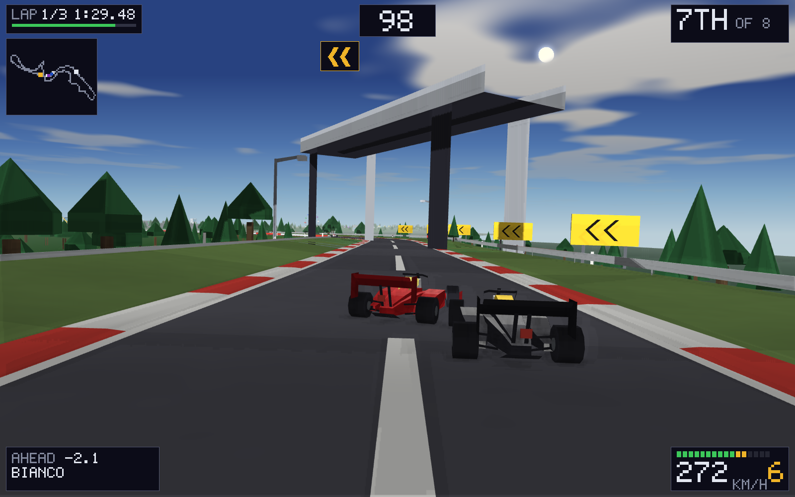

The corners are surveyed and the corners are therefore right. The elevation is
not surveyed — the source data is flat — so it is written by hand from what these
places do, and so is Zandvoort's banking. Everything you can see beside the road
is invented towards what makes each one recognisable. [docs/CIRCUITS.md](docs/CIRCUITS.md)
says where the geometry came from and what that obliges us to say about it: the
centre lines derive from OpenStreetMap and carry ODbL terms.

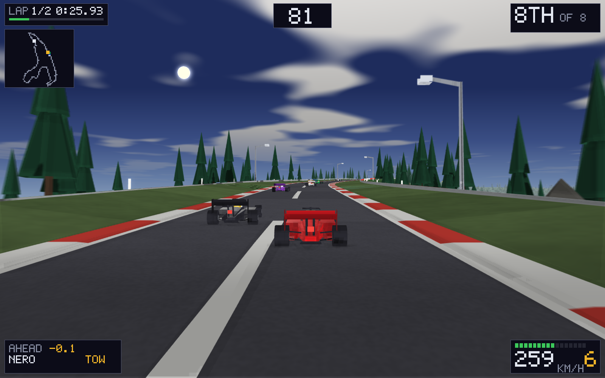

Two of them changed the engine rather than just adding to it. The road used to be
seven metres either side of the line everywhere; Monza is under four in places
and Spa reaches eight, so the width is now a property of each node. And a real
circuit folds back on itself, which the drawn ones never do — every node's ground
is now held under the height of the lowest road it could be drawn across, because
without that Zandvoort drew its own dunes over its main straight and covered the
sky in the colour of sand.

They are closed loops, and that is not a detail of the level design — it is the
shape of `route.js`. You cannot make a road that returns to where it started by
walking forwards and turning: the total turning has to come to exactly 2π *and*
the position has to land back on itself, and nudging a heading until it does is a
fight you lose. So it is built the other way round. A closed loop is drawn first,
as control points around a circle, and the headings and curvatures are read back
off it afterwards. Closure is then not something to be achieved; it is a property
of the thing that was drawn.

Everything that varies around the lap — the hills, the wobble in the hillsides,
the change from mountain to sea front — is a sum of harmonics *of the lap*, for
the same reason: a sine comes back to where it started because that is what a
sine does. So there is no seam at the start line, which is the piece of track
everybody looks at most.

Then the loop is relaxed until nothing on it is sharper than a car with a wing
can go round. A curve through control points will happily ask for a 37 km/h
hairpin, which is not a corner, it is a wall with a gap in it.

The other thing a loop changes is the scenery. On a road that never comes back on
itself the hillsides can do as they like; on a circuit the ground to your right
is the middle of the lap, which is also what you are looking across when you look
at the far side of the track — so a hundred and twenty metre hill in it is a
hundred and twenty metre hill drawn over the track. Which is exactly what it was,
and exactly what it looked like. The infield is now one flat plain a few metres
below the average height of the circuit. The outside may still do as it pleases:
it points away, and nothing it does can ever be in front of anything.

Every corner on every circuit is signed. Two boards on the approach, at sixty
metres and thirty, and then a board every eighteen metres down the outside of the
corner itself, so they read as a line following the road round rather than as
three separate signs. One chevron for a bend you take flat, two for a hundred and
ninety km/h, three for one that needs the brakes properly. It is the convention
every rally and half the circuits in the world already use, so it needs no
explaining, and it is there because at three hundred and fifty a corner arrives
in under two seconds from the point where the road stops looking straight.

No two of them ever disagree. A chicane is a left and a right forty metres apart:
the left wants its boards on the right of the road and the right wants its on the
left, so left alone they put up chevrons pointing both ways at once, at the one
moment you most need to be told a single thing. Every board is now bid for, and
the board about the corner you have not finished yet wins the ground.

Press **F** during a race for a frame meter: how long the last frame took, how
many simulation steps went into it, and how many triangles came out. The middle
number is the one that matters. `X1` is a game running at speed. `X2` and `X1`
alternating is a game that has run out of frame. `X0` and `X1` alternating is a
screen running faster than the simulation, which is fine — the world is drawn
where it is between ticks rather than where the last one left it, so a 120Hz
panel gets smoother motion than a 60Hz one rather than a stutter.

### On a phone

A thumbstick bottom left, throttle and brake bottom right, pause where it can be
reached and not hit by accident. `npm run test:touch` works out where all of that
lands on real device sizes and complains if it lands on the picture.

The playfield is ten by seven and a phone is not, so where the dead space falls
decides everything. **Sideways**, it falls down both sides as letterbox bars —
145 pixels of them on an iPhone 15, 163 on a Pixel — and those bars are exactly
where a thumb wants to be, so the controls are sized to fit inside them. They
cover 0–9% of the picture instead of the 11–23% they used to, and what they used
to cover was the two corners the head-up display lives in. **Standing up**, the
picture goes to the top of the screen rather than the middle, so the dead space
is one band underneath it, which is where the thumbs already are: the controls
clear the picture entirely.

## The look

Everything you can see is polygons standing in the world — no sprites, no
billboards, no textures anywhere. Go round a bend and the palm tree turns,
because it is actually there.

The renderer is about five hundred lines and does not use the GPU. It transforms,
clips, projects and fills every triangle by hand into a `Uint32Array` at 640 ×
448 — twice the 320 × 224 a Mega Drive put on a television, in the same ten by
seven shape, which is past what that machine could do and about what a Saturn
ran Virtua Fighter 2 at — and blows the result up to fit the window with the
smoothing turned off — by the browser, which is the important word. The canvas is 640 ×
448 and CSS stretches it, so the blow-up belongs to the compositor and costs
nothing. It used to be done here, one `drawImage` a frame from the buffer onto a
window-sized canvas: two and a third million pixels of nearest-neighbour scaling
in JavaScript, sixty times a second, and it cost more than everything else in
the frame put together. Six thousand flat triangles over two hundred and
eighty-seven thousand pixels is under four milliseconds; the scaling was another
thirteen, and none of it was visible to any tool in this repository, because the
headless harness stubs the canvas out and its `drawImage` does nothing at all.

What makes this read as sixteen-bit was never the pixel count. It is the flat
shading, the palette, and the fact that a tree is three polygons — and
more pixels make those clearer rather than less true. The HUD is laid out against
a fixed 480-wide space and scaled onto whatever the screen is, so it stops
shrinking every time that number goes up, which is what it had been quietly doing.

Doing it in software buys the one thing a modern pipeline will not give you,
which is the actual look:

- **Every colour is one of 32,768** — five bits a channel, snapped on the way in.
  It was 512 for a long time, the three bits a Mega Drive had, and three bits is
  what gives flat shading its bite: two greens that were nearly the same stop
  being nearly the same. But eight steps of blue cannot make a sky that is a
  gradient rather than a set of stripes, so it runs at what a Saturn held
  instead. The bite comes from the flat shading and the hard edges, and neither
  of those is about how many colours there are.
- **The track is chequered, not banded.** There is no grey between the two greys
  that palette has, so the lighter stripe is a one-pixel chequerboard of both,
  exactly the way the hardware faked a colour it did not have.
- **Smoke is a mesh, not a colour.** There is no alpha channel here. Tyre smoke
  is drawn with every other pixel missing, which is how these machines did
  transparency and the only honest way to do it — a solid light-grey polygon over
  the car is a white slab, and looks like a bug because it is one.
- **The sky is bands, chequered where they meet.** Five flat stripes read as
  five flat stripes; the same five with twenty rows of ordered dither between
  each pair read as one gradient, out of exactly the same five colours. That is
  the trick the hardware used and the only one available to a renderer with no
  more colours to give. Ordered rather than random, because noise crawls between
  frames and makes the sky look like it is fizzing.
- **The haze is one colour.** Everything distant fades to the colour the bottom
  of the sky is painted, so the horizon is a join you cannot see rather than a
  line.
- **There is no terrain model.** For every node of track in front of you the
  renderer walks outwards — tarmac, kerb, run-off, barrier, hillside, distance —
  and puts down a quad at each step. A mountain is the outermost of those a long
  way up; the sea is the outermost of them at zero.

### Where the speed comes from

Half of it is not speed. The car does 350 km/h, which is a number; the rest is
four things that cost nothing and are worth more than another fifty would be:

- **The lens opens with the throttle.** The focal length goes from 250 to 178
  between a standstill and flat out, so the world stops going past through the
  middle of the screen and starts going past at the edges. This is the single
  largest one.
- **The camera drops and closes in**, from two and a half metres above the
  tarmac to under two, and starts to shiver.
- **Marker posts every twenty-four metres, both sides, all the way round.** Two
  polygons each. At 350 they arrive eight times a second in your peripheral
  vision. Take them out and the car feels like it has lost fifty km/h.
- **Kerb stripes every six metres and a broken white line down the middle**, so
  there is something ticking past even on a straight with nothing beside it.
- **Landmarks you go round three times.** A big wheel turning on the infield with
  team-coloured cabins, two balloons and a helicopter holding station. The second
  time you see the wheel you know where you are on the lap without reading
  anything, which is the whole job of it.
- **A red suspension bridge that is part of the circuit**, laid on the
  straightest four hundred metres there is because a suspension bridge wants a
  straight, with the ground falling away to water on both sides of the deck. The
  cable is the whole thing: take it away and it is a road with red walls on it,
  put it back and it is a crossing, from half a mile away, in eight quads a node.
- **Floodlights that are actually lights.** After dark the lamp heads are not
  tinted with the rest of the world, and each one puts a pool on the tarmac. Your
  own headlights are brighter and gone by ninety metres; the floodlights are
  dimmer and go to the horizon, so the pool in front of you still reads as yours.
- **A day that ends.** Each time of day is one arithmetic operation applied to
  every colour that goes into the world — darken, then pull towards a wash — so a
  colour added tomorrow gets a night version for nothing. The sky is the
  exception and is replaced rather than tinted, because dusk is not a darker
  afternoon, it is a different set of colours in a different order. The head-up
  display is never tinted at all: a dashboard is lit from the inside.

There were streaks up the sides of the screen for a while as well. They came out
again: an artefact that does not belong to the world reads as a fault in the
renderer, whatever it was meant to suggest.

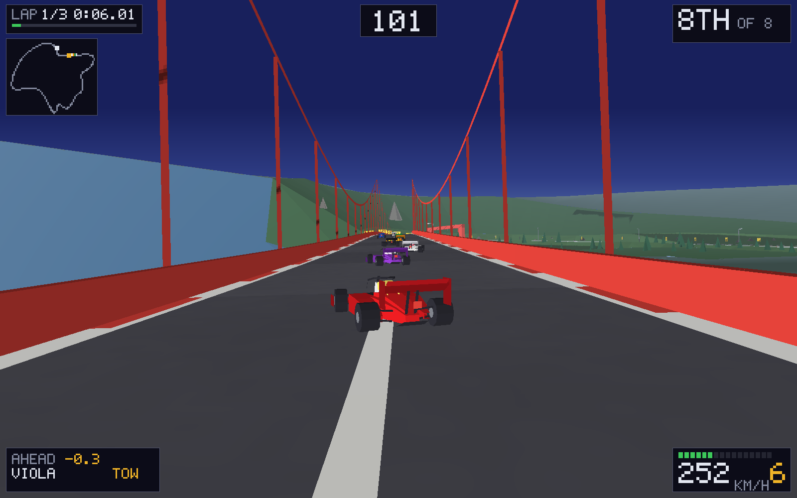

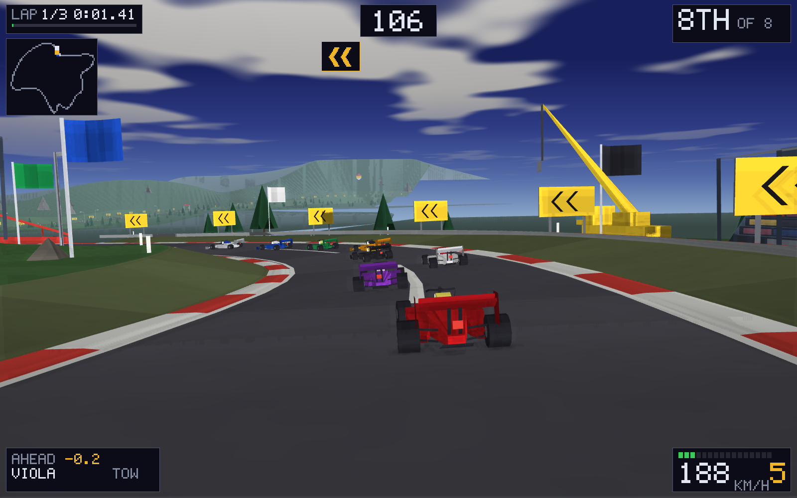

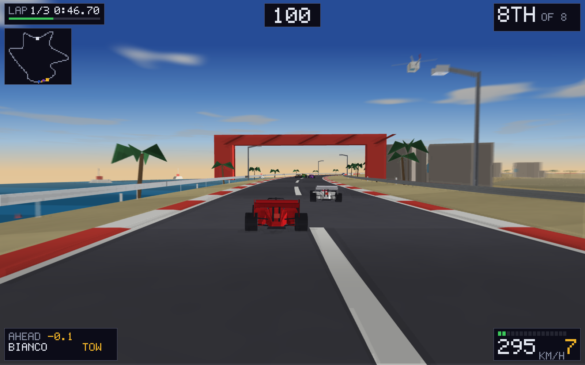

## How it is put together

```
src/
  constants.js      every number the game is made of
  config.js         the one line that points at a score board
  highscores.js     ten times a list, merged rather than overwritten
  audio.js          a V10 out of four oscillators, and everything else
  main.js           menus, the loop, the wiring between them
  game/
    route.js        the circuit: a closed loop, built once from a seed
    sim.js          sixty ticks a second, and the only thing that writes
    state.js        what a race is, and how to read it
  render/
    raster.js       the polygon renderer: transform, clip, fill, blit
    models.js       the car, and everything that is a thing not the ground
    palette.js      colour
    renderer.js     the camera, the world, the head-up display
tools/              tests, screenshots, icons
server/board.js     the development score board
worker/             the same board, as a Cloudflare Worker
```

Four ideas hold it up.

**The player is a car and nothing else.** There is no code anywhere that says
"if this is the player": the same function drives, the same function works out
whether the corner is going to have it, and the same function decides that two
cars cannot be in the same place. What the player has that the others do not is a
six-bit input mask instead of a mind.

**Everything is measured along the track, not across the world.** A car is a
distance and an offset. Two cars are near each other when their distances are
close, which is one subtraction; who is winning is whoever has the larger one;
and the lap somebody is on is that distance divided by the length of the circuit.
Driving backwards over the line takes the lap counter down again, which is
exactly right and is not a case anybody had to write.

**The circuit is built from a seed, once.** A lap time is worthless if the track
was different, and a track generated as you drive it cannot be learned, which is
the only thing that makes a time come down on the tenth attempt.

**The simulation never reads the clock.** It runs at a fixed sixtieth and the
loop runs it as many times as real time says it should have; a slow machine drops
frames, never ticks. A time on the board has to mean the same thing on every
machine that set it.

## The score board

Ten times per mode per circuit per setting, sorted quickest first, kept in
`localStorage` so a browser on its own needs nothing. Point `src/config.js` at a
Cloudflare Worker and every page posts its board and reads everybody else's back;
boards are *merged* by row id rather than overwritten, so two devices and two
browsers add up instead of taking turns. `worker/README.md` is the two commands,
plus the broom for when somebody puts something on it you would rather they had
not.

A qualifying lap only has to exist. A race has to have been finished — a board of
race times cannot hold one that stopped halfway, because somebody who gave up on
lap one has a shorter elapsed time than anybody who got to the flag.

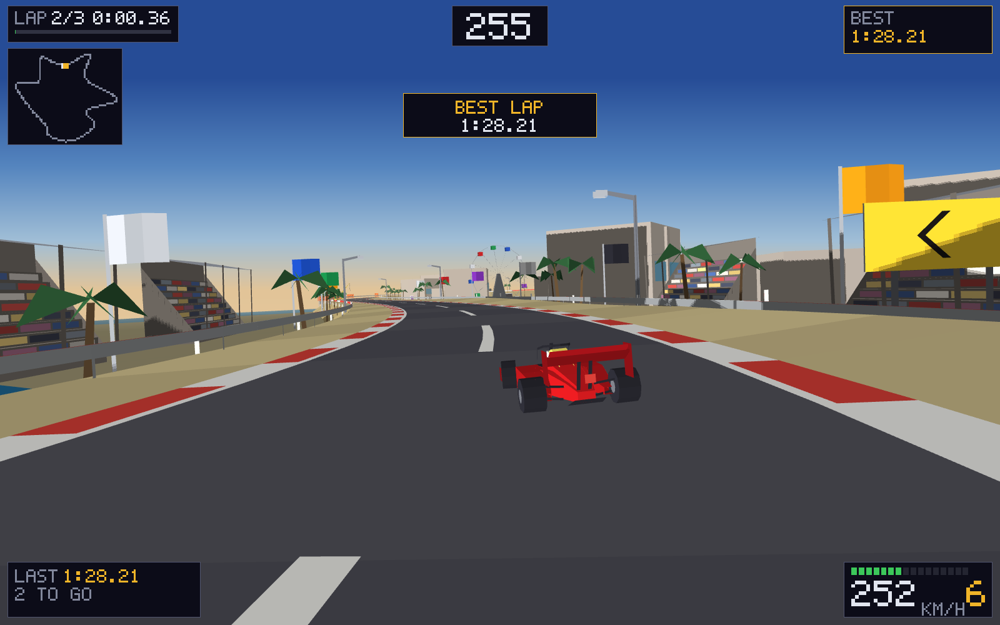

## Tests

```bash
npm test
```

Three things, none of which need a browser:

- `tools/simtest.js` checks the circuits close — that the headings come back
  round having turned through exactly one lap, and that the pair of nodes
  straddling the start line is the same length as every other pair, because if it
  is not there is a bump on the piece of track everybody drives most. Then it
  drives each of them with the game's own reference driver and asks the questions
  a bug would answer wrongly: is anybody outside the barriers, did the field race,
  did the laps count, is somebody still within ninety metres of you for most of
  the race — and the two that are about the game rather than the code: **is
  braking later still quicker**, and **is driving properly still quicker than
  driving flat out at the barriers**. It runs the same
  driver at three levels of commitment and fails if it is not. A driving model
  that gets that wrong is broken however finite its numbers are, and nothing else
  here would notice.
- `tools/pagecheck.js` builds a document out of `index.html` — every id that is
  actually in the markup and nothing else — imports `main.js` against it, presses
  start, and drives four seconds of the real loop. An element the code asks for
  that the markup does not have comes back `null`, exactly as it would in a
  browser.
- `tools/sync-shared.js` checks the five files this game shares word for word
  with the other four have not drifted apart.

And when the question is what it looks like rather than whether it works:

```bash
node tools/screenshot.js pass 1500 6 3    # circuit, tick, how many, blow-up
node tools/screenshot.js docs             # the set in this README
```

The renderer needs three things from a browser and no more — an `ImageData`, a
canvas and a 2D context — so twenty lines of stubs run it under node and write
PNGs. Every picture above came out of that.

## Licence

MIT. See [LICENSE](LICENSE).
