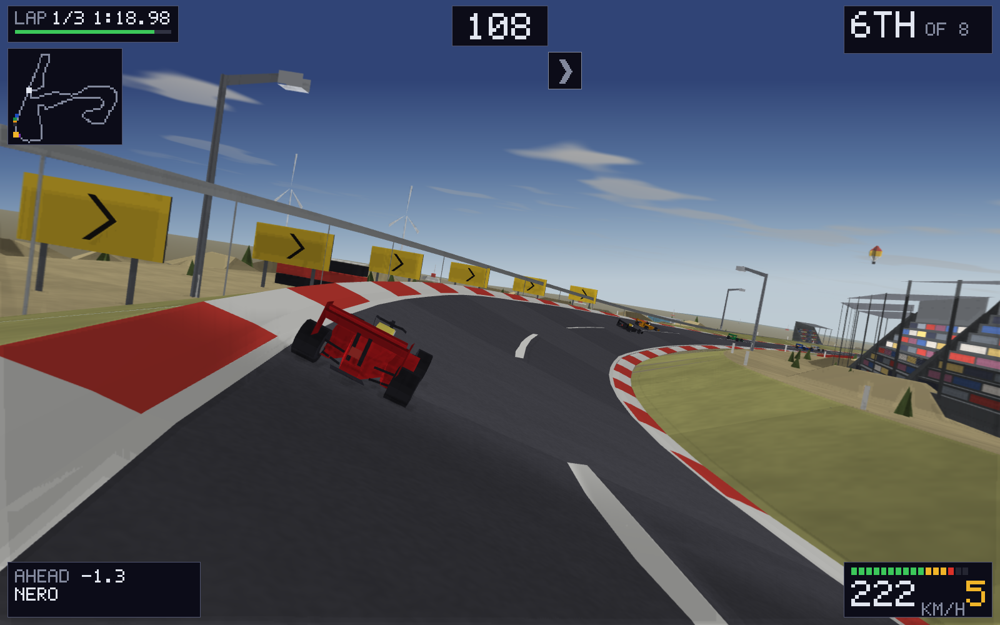
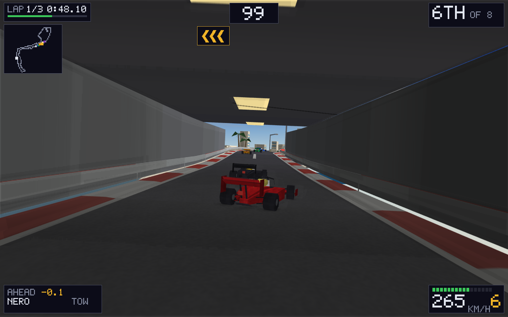
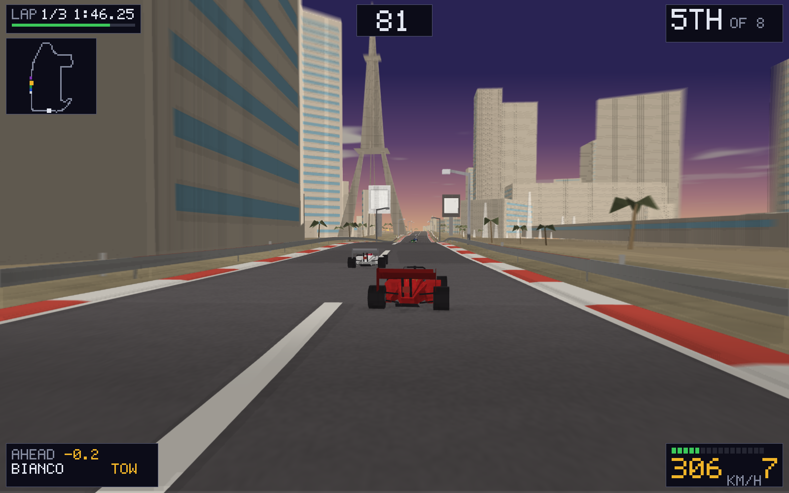
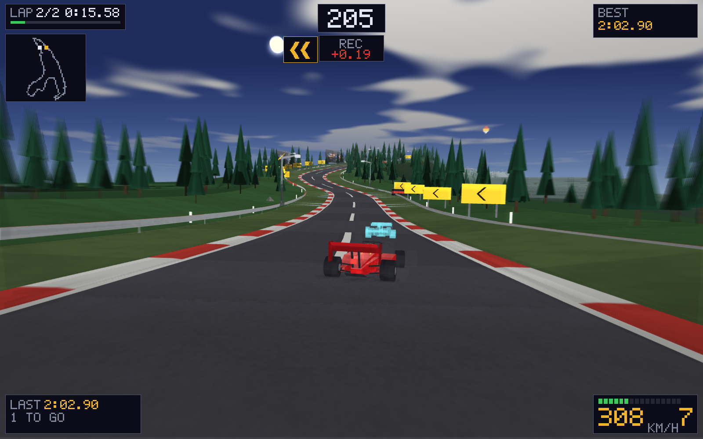
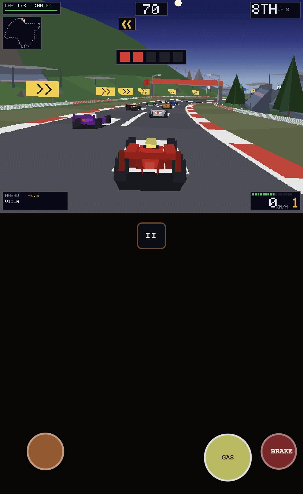

# WebTrack

### ▶ [Play it](https://markclausing.github.io/webtrack/)

A polygon racing game in the browser, in the spirit of the first generation of
them. Twenty-seven closed circuits, eight single seaters, and an afternoon that
runs out: you start in daylight, the sun is on the horizon by the second lap and
you finish in the dark.

No dependencies, no build step, no assets — HTML, CSS and JavaScript exactly as
the browser receives them, and a WebGL renderer of about nine hundred lines with
no library behind it. The picture is drawn at the size of your window: flat
shaded, lit by one sun that casts real shadows, and nothing in it is a sprite.

There are exactly three textures and they are not loaded from anywhere. The
tarmac, the ground beside it and the concrete are written into a byte array at
startup out of a seeded generator, in about twenty milliseconds, and that is why
this repository has no `assets/` folder. They are not colours, either: every
colour here was chosen against a palette and then put through a time-of-day
transform, so the textures are grey modulations with a mean of one and the shader
multiplies. The tarmac stays the colour the palette says and gains an aggregate.



*Zandvoort's last corner: eighteen degrees of dish, and the car leaning into it.*

## The circuits

**Twenty-four of them are places**, and between them they are the whole of the
2026 Formula One calendar.

**Sixteen came from a survey** — a centre line and a width, and nothing else. So
their height, their banking and everything beside the road was written by hand:
Eau Rouge twenty-nine metres below the start line and Les Combes sixty-seven
above it, Zandvoort's two dished corners at eighteen degrees, the derelict oval
alongside the Serraglio at Monza, the big wheel over Suzuka's infield.

**Eight were measured off OpenStreetMap**, and almost nothing about those was
decided here. The road is the road the map has. The height was sampled at every
point of the lap. Monaco's tunnel is where the tags say a tunnel is, its
buildings stand on their own footprints at their own heights, and its yachts lie
along Port Hercule's own piers. Monaco, Baku, Singapore, Losail and Las Vegas
come out within a per cent of their published lap length; Baku to the metre.

**Three were drawn by a random number generator** — a mountain pass, a coast
road and a long fast circuit — and they are still the best three to learn on.

[docs/CIRCUITS.md](docs/CIRCUITS.md) is where the measured ones came from and
what it cost to get them right.



*Monaco's tunnel. The roof is there because the map says a tunnel is.*

And the landmarks are where the landmarks are. On the Strip you pass the Palazzo
and the Venetian's campanile, Caesars, the Eiffel Tower of Paris Las Vegas and
the fountains, each one at the point of the lap its own coordinates put it at —
with the Strat two and a half kilometres north on the skyline and the south end
of the Strip away in the other direction.



*Las Vegas. The buildings either side are measured; what is invented is which
one of them is which.*

## Driving it

**The road is not one surface.** Tarmac, then a metre and a half of kerb, then
grass, then whatever is past that. A kerb costs almost nothing and rumbles under
the wheels — the ridges go past faster the quicker you are going. Putting a wheel
in the grass costs you 27 km/h in a second, two wheels more, and the grass stays
on the tyres for about three seconds after you rejoin. Running wide is a mistake
rather than a wider line.

**All of it is measured from the outside wheel**, not from the middle of the
car, so a wheel over the edge is a wheel over the edge.

**The sun is somewhere, and everything knows where.** It sits on a fixed bearing
in the world, so coming out of a corner with it ahead of you is a different
thing from coming out with it behind. Every face carries its normal, so a
building has a bright side and a dark side and they change over as the afternoon
goes — and the cars, the trees, the barriers and the grandstands all cast into a
shadow map that follows the car up the road.

**And at three hundred the edges of the picture smear.** Radially, and by the
square of the distance from the middle — nothing at all where you are looking,
and most of it where the kerbs are going past. It joins the three things this
game already did to say *fast*: the lens opening from fifty degrees to seventy,
the camera dropping two feet and coming in, and the whole thing starting to
shiver.

**A circuit does not move, so it is built once.** Eighteen hundred metres of
road, kerbs, barriers, ground and several thousand trees used to be walked,
transformed and written out sixty times a second, because the colours had to be
worked out again for the time of day. That went into the shader, so the whole lap
goes into one buffer when the race starts and a frame is a range of it — two draw
calls. What is left being built every frame is what actually changes: the eight
cars and their smoke, the eight kinds of prop that turn or flap or light up at
dusk, and the surf. On the fastest circuit in the game that took a frame from
four milliseconds of JavaScript to one and a half.

**And the models have no texture coordinates**, which is why the three that exist
are sampled from where a surface is in the world rather than from a picture of
it. Fifteen hundred lines of polygons written out by hand, not one of which says
where it is on an image — but every one of them knows where it is standing, and
for a road and a field that is the same information.

**There is weather.** The sky was a gradient, which is a perfectly good sky for a
game drawn at three hundred and twenty pixels across and is also a third of the
screen that does not move when you do. There is a cloud deck seven hundred metres
up now, sampled where the ray through each pixel crosses it — so the clouds sit
in the world rather than on the screen: they stay put as you go round a corner,
they come towards you down a straight, and they go orange at dusk along with
everything else, because they go through the same one-colour-at-a-time transform
the rest of the game does.

**The kerbs stand up.** Five centimetres over three faces — a ramp the car
climbs, a flat top and a lip down the far side — so the edge of the road catches
the light differently from the road itself. And everything sitting on the ground
is darkened where it meets it, worked out from the depth of what is around each
pixel: the gap under a car, the inside of a corner, the step off a kerb.

**And some things are brighter than the screen.** The picture is drawn into a
floating point buffer, so the sun, a floodlight, the rain light on the back of
the car you are chasing and the highlight running along a wing can all be
brighter than white — which is what lets them bleed into what is around them.
Only the last fifth of the range is folded back in at the end: everything below
it is left exactly as it was chosen.

**The wing is yours to choose.** Low, medium or high, in the menu, and it is a
trade rather than an upgrade: the small wing is about 373 km/h flat out, the big
one 333, and the big one is the quicker car in every corner in between. Monza
and Las Vegas want the small one, Monaco and Singapore want the big one, and on
a circuit that is neither the medium is as good as either. The other seven cars
run the medium wing whatever you pick, and the board never asks which you had.

**The tow is real.** Sitting in somebody's hole in the air is the only thing that
will drag you past them on a straight, and the only warning you get that it has
stopped working is the noise going quiet.

**Corners are banked and cambered** where the circuit is, and the car leans with
them. Chevron boards on the outside of every corner tell you which way it goes
and how hard, and no two of them ever contradict each other.

**And the ground is the ground.** Austin's turn one is thirty-three metres
straight up and blind over the top; Eau Rouge is twenty-nine metres below the
start line and Les Combes sixty-seven above it.

## Two ways out

**Qualifying** is one lap on an empty circuit, and there is a ghost on it with
you: your own best lap here, replaced by the quickest lap anybody has posted as
soon as it arrives. It is drawn as a stippled cyan silhouette you cannot hit, and
under the clock is the difference — where that lap was at *this place*, in green
or red. It sets off level with you at every crossing, which is why the quick lap
is usually the second or the third.

**A grand prix** starts you eighth of eight against seven cars in the same
machinery, over three laps, with a clock that runs out unless you reach the next
gantry. They defend, they take a line, and they leave you a gap only if you have
earned it.

Whichever you drive, the time goes on a board shared with everybody else who
plays it.

**And the afternoon runs out** whichever you drive. You start in daylight and
finish under the floodlights, and the four circuits that are run at night — Las
Vegas, Jeddah, Singapore, Losail — are dark from the flag.



*The ghost a tenth up the road at Spa, and the climb out of Eau Rouge ahead.*

## Controls

|            | Keys      |
| ---------- | --------- |
| Accelerate | `↑`       |
| Brake      | `↓`       |
| Steer      | `←` / `→` |
| Pause      | `Esc`     |

Every key can be changed in the menu and W A S D is a preset. Gamepads need no
setting up: the stick steers and any face button is the throttle.

On a phone the controls come up on their own: the wheel bottom-left, `GAS` and
`BRAKE` bottom-right, and the pause under the picture. Standing up they fall
entirely clear of the road; sideways they sit in the letterbox bars either side
of it, which is what `npm run test:touch` checks on seven handsets.



## Running it yourself

```bash
git clone https://github.com/markclausing/webtrack.git
cd webtrack && npm start
```

Then open http://localhost:8080/. There is no `npm install`, because there is
nothing to install.

`npm test` drives the whole thing headlessly: races to the flag on every
circuit, checks that nothing is standing on the road, that every recorded lap
survives being written down and read back, and that the game asks for the sounds
it says it does. It needs no graphics card — the renderer is built against a
stub of one, which is enough to catch everything except what the picture looks
like.

The picture is checked by looking at it:

```bash
node tools/screenshot.js docs       # the set this README uses
node tools/modelshot.js             # one model, on its own, from three sides
node tools/modelshot.js --prop=stand --dist=30
```

Both drive a headless Chrome over the DevTools protocol, because a WebGL
renderer needs a graphics driver and a graphics driver needs a browser. That is
a WebSocket and some JSON, so it is still no dependencies.
[worker/README.md](worker/README.md) has the two commands that put the shared
board live.

## Elsewhere

The fifth game built this way, after
[websoccer](https://github.com/markclausing/websoccer),
[webtennis](https://github.com/markclausing/webtennis),
[webracing](https://github.com/markclausing/webracing) and
[webtype](https://github.com/markclausing/webtype).

Circuit geometry for the twenty-four real ones is derived from OpenStreetMap and
carries **ODbL 1.0** — see [docs/CIRCUITS.md](docs/CIRCUITS.md). Everything else
is MIT; see [LICENSE](LICENSE).
