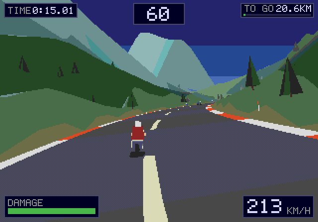
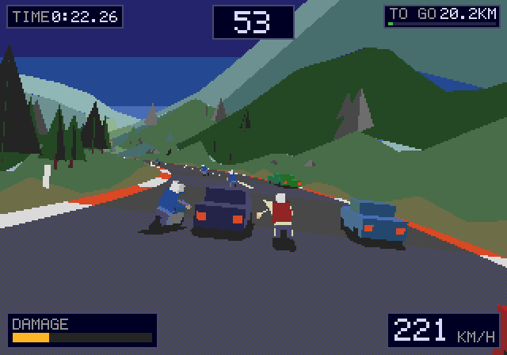
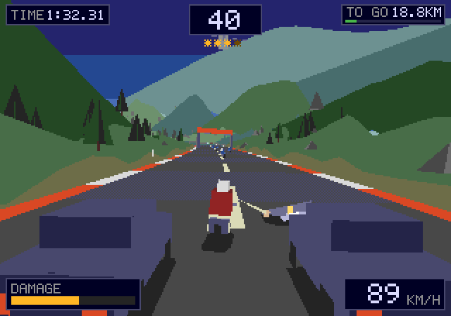
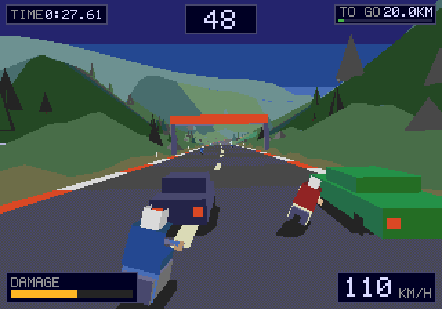

# WebTrack

### ▶ [Play it](https://markclausing.github.io/webtrack/)

A motorcycle road war, in polygons, at 320 × 224. You are on a big twin with a
clock running, ten kilometres of mountain pass or sea front in front of you, and
a road full of people who would rather you did not finish: rival riders, two
gangs who attack from bikes and out of car windows, traffic going both ways, and
eventually the police. There is one way to buy time and it is not the throttle.

Your time at the far end is the score, and it goes on a shared board.

No dependencies, no build step, no WebGL — HTML, CSS and JavaScript exactly as
the browser receives them, and a polygon renderer written by hand into a
`Uint32Array`. It is the fifth game built this way, after
[websoccer](https://github.com/markclausing/websoccer),
[webtennis](https://github.com/markclausing/webtennis),
[webracing](https://github.com/markclausing/webracing) and
[webtype](https://github.com/markclausing/webtype).



## Running it yourself

```bash
git clone https://github.com/markclausing/webtrack.git
cd webtrack && npm start
```

Then open http://localhost:8080/. There is no `npm install`, because there is
nothing to install.

## Controls

|                        | Keys            |
| ---------------------- | --------------- |
| Throttle               | `W`             |
| Brake                  | `S`             |
| Lean left / right      | `A` / `D`       |
| Punch, or club         | `Space`         |
| Kick                   | `Q`             |
| Pause                  | `Esc`           |

Every key can be changed in the menu. Gamepads need no setting up: the stick
steers and any face button swings.

On a phone, hold it sideways. The bottom-left corner is the stick, `HIT` is the
big button, `KICK` is the small one beside it, and the little `II` at the top
pauses.

## How it plays

**The clock is the game.** Seventy-five seconds to start with, and a gantry over
the road every thirteen hundred metres puts forty-eight more back. Nothing else
ends a run early except the police. Your elapsed time is what the board keeps —
so the clock you race against and the time you are judged on are two different
numbers, which is the oldest arrangement in the genre and still the best one.

**Fighting is faster than riding.** Every rider you put down comes off your final
time: three seconds for a rival, four for a gang member, eight for a policeman.
Riding a clean ten kilometres will not beat somebody who stopped four times to
have a fight, and stopping five times will not beat either of them. Finding that
line is the whole game.



**Hit the side you are leaning towards.** Steer into somebody and swing and the
fist goes their way; let go of the bars and it goes at whoever is nearest, which
is what you want ninety times out of a hundred. A kick is worth half again as
much and leaves your hands off the bars for twice as long, and half a second is a
long way at two hundred.

**Whatever they drop is yours.** Put down a rider carrying a club and it lies in
the road; ride over it and it is in your hand. A club is twice a fist, a
policeman's baton is the same and rather more embarrassing to be hit with.

**The law counts.** Every knockdown raises the stars in the middle of the screen.
At one a patrol comes up behind you. At three there is a helicopter over the road
and they arrive two at a time. Behaving brings it down again — about a minute of
riding clean gets you from the helicopter back to nothing, which is long enough
that it costs you the fight you were winning. Going down with a patrol alongside
is not a crash, it is an arrest, and the run ends there.



**Two roads, and they are two different games.** The pass is switchbacks, blind
crests and gradients that take back on the way up everything they gave on the way
down; there is nowhere to fight on it and you have to anyway. The boulevard is
flat and open and the only thing slowing you down is what is on it. The grand run
is both, without stopping, and it is the only time worth having.


## The look

Everything you can see is polygons standing in the world — no sprites, no
billboards, no textures anywhere. Ride round a bend and the palm tree turns,
because it is actually there.

The renderer is about four hundred lines and does not use the GPU. It transforms,
clips, projects and fills every triangle by hand into a `Uint32Array` at 320 ×
224, which is what a Mega Drive put on a television, and blows the result up to
fit the window with the smoothing turned off. That is not the slow way round: two
thousand flat triangles over seventy-one thousand pixels is about a millisecond
and a half, which leaves fifteen of the sixteen a frame gets.

Doing it in software buys the one thing a modern pipeline will not give you,
which is the actual look:

- **Every colour is one of the 512 that machine could make** — three bits a
  channel, snapped on the way in. Two greens that were nearly the same stop being
  nearly the same, which is what flat shading wants anyway.
- **The road is chequered, not banded.** There is no grey between the two greys
  that palette has, so the lighter stripe is a one-pixel chequerboard of both,
  exactly the way the hardware faked a colour it did not have.
- **The sky is bands and the fog is one colour.** Everything distant fades to the
  colour the bottom of the sky is painted, so the horizon is a join you cannot
  see rather than a line.
- **There is no terrain model.** For every node of road in front of you the
  renderer walks outwards — tarmac, rumble strip, verge, hillside, distance — and
  puts down a quad at each step. A mountain is the outermost of those a long way
  up; the sea is the outermost of them at zero.



## How it is put together

```
src/
  constants.js      every number the game is made of
  config.js         the one line that points at a score board
  highscores.js     ten times a list, merged rather than overwritten
  audio.js          a V-twin out of two oscillators, and everything else
  main.js           menus, the loop, the wiring between them
  game/
    route.js        the road, built once from a seed
    sim.js          sixty ticks a second, and the only thing that writes
    state.js        what a run is, and how to read it
  render/
    raster.js       the polygon renderer: transform, clip, fill, blit
    models.js       everything that is a thing rather than the ground
    palette.js      colour
    renderer.js     the camera, the world, the head-up display
tools/              tests, screenshots, icons
server/board.js     the development score board
worker/             the same board, as a Cloudflare Worker
```

Four ideas hold it up.

**The player is a rider and nothing else.** There is no code anywhere that says
"if this is the player": the same function rides the bike, the same function
swings the arm, and the same function decides somebody has taken enough. What the
player has that the others do not is a five-bit input mask instead of a mind.
That is why a rival will knock a policeman off, why a policeman will flatten a
gang member who gets between you, and why none of that needed writing.

**Everything is measured along the road, not across the world.** A rider is a
distance and an offset; so is a car, a dropped club and a checkpoint. Two things
are near each other when their distances are close, which is one subtraction, and
the road being a mile of hairpins costs the collision test nothing at all.

**The road is built from a seed, once.** A time is worthless if the road was
different, and a road generated as you ride it cannot be learned — which is the
only thing that makes a time come down on the tenth run. Who is *on* the road is
another matter and is spawned around you, because a rider who spent ninety
seconds on the floor should not arrive at an empty world.

**The simulation never reads the clock.** It runs at a fixed sixtieth and the
loop runs it as many times as real time says it should have; a slow machine drops
frames, never ticks. A time on the board has to mean the same thing on every
machine that set it.

## The score board

Ten times per road per setting, sorted quickest first, kept in `localStorage` so
a browser on its own needs nothing. Point `src/config.js` at a Cloudflare Worker
and every page posts its board and reads everybody else's back; boards are
*merged* by row id rather than overwritten, so two devices and two browsers add up
instead of taking turns. `worker/README.md` is the two commands, plus the broom
for when somebody puts something on it you would rather they had not.

Only a finished run goes on the board. A board of times cannot hold a run that
stopped halfway — somebody who gave up after four hundred metres has a shorter
elapsed time than anybody who finished.

## Tests

```bash
npm test
```

Three things, none of which need a browser:

- `tools/simtest.js` rides every route for four minutes with a hand on the bars
  that is deliberately not very good, and then asks the questions a bug would
  answer wrongly: is anybody outside the world, did the clock move, did the
  fighting happen, does the same seed still ride the same run.
- `tools/pagecheck.js` builds a document out of `index.html` — every id that is
  actually in the markup and nothing else — imports `main.js` against it, presses
  start, and drives four seconds of the real loop. An element the code asks for
  that the markup does not have comes back `null`, exactly as it would in a
  browser.
- `tools/sync-shared.js` checks the five files this game shares word for word
  with the other four have not drifted apart.

And when the question is what it looks like rather than whether it works:

```bash
node tools/screenshot.js pass 1500 6 3    # route, tick, how many, blow-up
node tools/screenshot.js docs             # the set in this README
```

The renderer needs three things from a browser and no more — an `ImageData`, a
canvas and a 2D context — so twenty lines of stubs run it under node and write
PNGs. Every picture above came out of that.

## Licence

MIT. See [LICENSE](LICENSE).
